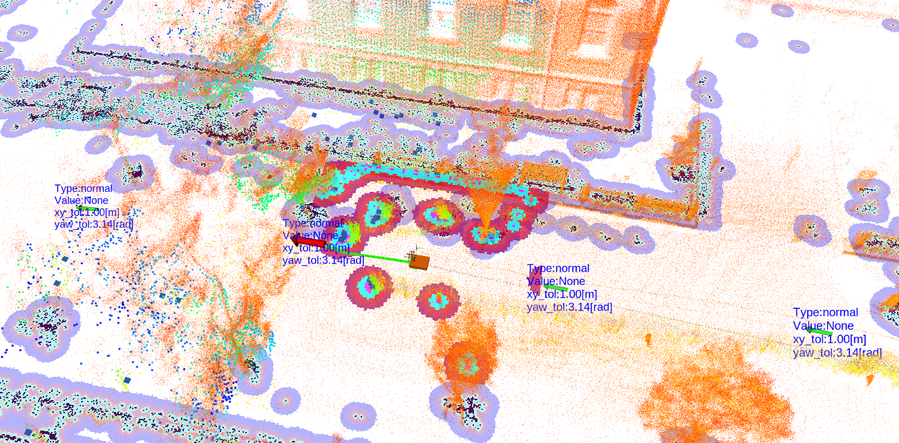
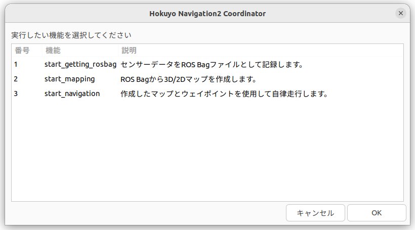

# hokuyo_navigation2

`hokuyo_navigation2`は、北陽電機製の3D LiDAR, RTK-GNSS一体型センサ RSF 専用のROS 2ベースの屋内外対応ナビゲーションシステムです。
3D-SLAM、自己位置推定、ROS 2 Navigation Stack (Nav2)を連携させ、高精度な自律移動を実現します。また、直感的な操作を可能にするWebベースのGUI `hokuyo_navigation2_gui` を用いることで、マッピングからナビゲーションまでの一連の操作をブラウザから簡単に行うことができます。



---

## 目次

- [hokuyo\_navigation2](#hokuyo_navigation2)
  - [目次](#目次)
  - [主な機能](#主な機能)
  - [依存関係](#依存関係)
    - [システムツール](#システムツール)
    - [ROS 2 パッケージ](#ros-2-パッケージ)
    - [Python パッケージ](#python-パッケージ)
  - [ビルド](#ビルド)
  - [実行方法](#実行方法)
    - [方法1: ブラウザベースのGUIを使用する](#方法1-ブラウザベースのguiを使用する)
    - [方法2: ターミナルから使用する](#方法2-ターミナルから使用する)
  - [パッケージ構成](#パッケージ構成)
  - [プログラムの説明](#プログラムの説明)
    - [ROS 2 ノード \& ツール](#ros-2-ノード--ツール)
      - [ROS 2 ノード](#ros-2-ノード)
      - [hokuyo\_slam\_ros2](#hokuyo_slam_ros2)
      - [hokuyo\_lio\_to\_map, 3D点群マップから2D占有格子マップへ変換](#hokuyo_lio_to_map-3d点群マップから2d占有格子マップへ変換)
    - [Launch ファイル](#launch-ファイル)
    - [実行・補助スクリプト](#実行補助スクリプト)
      - [ナビゲーション実行スクリプト](#ナビゲーション実行スクリプト)
      - [scripts/00\_sample\_util/ (ユーティリティスクリプト)](#scripts00_sample_util-ユーティリティスクリプト)
      - [scripts/ctrl/ (制御スクリプト)](#scriptsctrl-制御スクリプト)

---

## 主な機能

- **ロボットとセンサノードの起動**
  - モータドライバ・センサのROS2ノードの起動
- **3D SLAMと2Dウェイポイントファイル出力の同時実行**:
  - `hokuyo_lio` を用いた高精度なLiDAR慣性オドメトリ（LIO）と3D点群マップ生成。
  - ROS Bagから`lio_raw`（軌跡ベース）または`p2o`（点群ベース）の3Dマップ（`.pcd`）を作成。
  - 3D点群マップ生成と同時にウェイポイント作成
  - 3D点群マップをNav2用の2Dグリッドマップ（`.pgm`, `.yaml`）へ変換。

- **ナビゲーション**:
  - `hokuyo_rsf`を利用したリアルタイム3D自己位置推定を用いた自律走行
  - 3D点群マップと`simple_fastlio_localization` を利用したリアルタイム自己位置推定を用いた自律走行
  - Nav2 (Navigation2) スタックと連携し、指定されたウェイポイントに沿った自律走行。
  - 単一マップ走行および複数マップを連続して走行するマルチマップナビゲーションに対応。

- **ブラウザベースの統合GUI [`hokuyo_navigation2_gui`](https://github.com/hokuyo-rd/hokuyo_navigation2_gui)**:
  - **プロセス実行**: データ取得、マッピング、ナビゲーションの各プロセスをブラウザから起動。
  - **ファイル管理**: マップ、ウェイポイント、設定ファイルなどをブラウザ上で管理（作成、名前変更、削除）。
  - **高機能エディタ**:
    - **Map Viewer**: 3D/2Dマップとウェイポイントを視覚化し、GUI上で直感的にウェイポイントを編集（追加、移動、回転、属性変更）。
    - **CSV Editor**: マルチマップ走行シナリオをテーブル形式で簡単に編集。

## 依存関係

### システムツール
以下のツールがシステムにインストールされている必要があります。
```bash
sudo apt-get update
sudo apt-get install -y tree xdotool wmctrl zenity bc
```

### ROS 2 パッケージ
本パッケージは以下のROS 2パッケージに依存しています。

**※※ 本パッケージは、モータドライバ`icart_mini_driver_ros2` を使用しています。モータドライバを変更する場合は、[ナビゲーション実行スクリプト](#ナビゲーション実行スクリプト) の `nav_common.sh` 内の`launch_motor_driver` 関数を編集してください。※※**

**以下を全てインストールすることが前提となっております。`hokuyo_navigation2` に以下をまとめてクローン・ビルドする方法が記載されているので、参照ください。**

- [**hokuyo_rsf**](https://github.com/Hokuyo-aut/hokuyo_rsf.git)
  - Hokuyo RSF センサの ROS2 パッケージです。GNSSとLiDAR Inertial Odometry (LIO) の相互変換による位置出力 (Odometry, fix) を提供します。
- [**vizanti**](https://github.com/hokuyo-rd/vizanti.git)
  - Webブラウザ上でROSトピックを可視化するためのツール。
  - `hokuyo_navigation2_gui` の Map Viewer 機能のバックエンドとして使用されます。
- [**rosbridge_suite**](https://github.com/hokuyo-rd/rosbridge_suite.git)
  - websocket を使ってウェブで ROS Topic 通信を実現するパッケージ vizanti が依存
- [**jsk_visualization**](https://github.com/hokuyo-rd/jsk_visualization.git)
  - RViz2 のカスタムヴィジュアルプラグイン
- [**hokuyo_slam_ros2**](https://github.com/hokuyo-rd/hokuyo_slam_ros2.git)
  - 3D SLAM アルゴリズム `p2o` を提供するパッケージ。
  - 高精度な3D点群マップの生成に使用されます。
- [**simple_fastlio_localization**](https://github.com/hokuyo-rd/simple_fastlio_localization.git)
  - LIOベースの自己位置推定パッケージ。
  - 事前に作成した3Dマップ上での現在のロボット位置を推定します。
- [**fix2xyz**](https://github.com/hokuyo-rd/fix2xyz.git)
  - GNSSデータ (NavSatFix) を直交座標系 (XYZ) に変換するツール。
  - GNSSを使用したナビゲーションやマッピングで使用されます。
- [**lio_nav2_bringup**](https://github.com/hokuyo-rd/lio_nav2_bringup.git)
  - LIOとNav2を連携させて起動するためのLaunchファイル群を含むパッケージ。
- [**waypoint_manager**](https://github.com/hokuyo-rd/waypoint_manager.git)
  - Waypoint
  - Nav2 に ウェイポイントを送信するノード

### Python パッケージ
```bash
cd <YOUR_ROS2_WORKSPACE>/src/hokuyo_navigation2
pip3 install -r src/requirements.txt
```

## ビルド

1.  **ワークスペースのセットアップ**:
    ROS 2ワークスペースを作成し、`src`ディレクトリに本パッケージをクローンしrosdep コマンドで依存関連パッケージをインストールします。

    ```bash
    cd <your_colcon_ws>
    git clone https://github.com/hokuyo-rd/hokuyo_navigation2.git
    rosdep install -i --from-path src/ -y
    ```

2.  **ディレクトリ作成**:
    ビルドに必要なディレクトリ map/ waypoints/ rosbag/ を作成します。
  
    ```bash
    mkdir -p <your_colcon_ws>/src/hokuyo_navigation2/map
    mkdir -p <your_colcon_ws>/src/hokuyo_navigation2/waypoints
    mkdir -p <your_colcon_ws>/src/hokuyo_navigation2/rosbag
    ```

3.  **実行権限の付与**:
    スクリプトに実行権限を付与します。
    ```bash
    cd <your_colcon_ws>/src/hokuyo_navigation2/hokuyo_navigation2
    chmod +x scripts/*.sh scripts/*/*.sh src/*.py
    ```

3.  **ビルド**:
    ワークスペースのルートで`colcon build`を実行します。
    ```bash
    cd <your_colcon_ws>
    colcon build
    colcon build --symlink-install --packages-select hokuyo_navigation2
    ```

## 実行方法

本システムは、GUIからの操作とCUIから`coordinator.sh`スクリプトを直接実行する方法があります。GUIからの操作が推奨されますが、CUIから`coordinator.sh`スクリプトを実行することも可能です。


### 方法1: ブラウザベースのGUIを使用する

Webサーバーとvizantiサーバーを起動します。
```bash
# サーバー起動スクリプト
./scripts/00_sample_util/start_server.bash
```
```bash
# サーバー停止スクリプト
./scripts/00_sample_util/stop_server.bash
```
```bash
sudo ufw allow 5050 # hokuyo_navigation2_gui
sudo ufw allow 5050/tcp
sudo ufw allow 5000 # vizanti
sudo ufw allow 5000/tcp
sudo ufw allow 5001 # vizanti
sudo ufw allow 5001/tcp
sudo ufw allow 9090 # vizanti
sudo ufw allow 9090/tcp
sudo ufw enable 
```

Webブラウザで `http://<ホストマシンのIPアドレス>:5050` にアクセスします。GUIの指示に従い、マッピングやナビゲーションを実行してください。詳細は `hokuyo_navigation2_gui` のドキュメントを参照してください。

### 方法2: ターミナルから使用する

`coordinator.sh`は、Zenityを利用したメニューを通じて、マッピングやナビゲーションなどの各機能を実行するための統合スクリプトです。
**ウェイポイントの編集機能はございません。**

**coordinatorの実行**:
    スクリプトを実行すると、実行したい機能を選択するダイアログが表示されます。
```bash
ros2 run hokuyo_navigation2 coordinator.sh
```


**選択可能なオプション**:
- `start_get_rosbag`: ROS Bag を取得するためにセンサやロボットのノードを起動します。
- `start_mapping`: 3D SLAMと2Dウェイポイントファイル出力の同時実行: ROS Bagファイルを使用して、以下のSLAMアルゴリズムを実行します。SLAM実行時にウェイポイントファイル.jsonが作成されます。
ウェイポイントの編集はCUIからは実行できないため、GUIを使ってください。
    - p2o (hokuyo_slam を用いた3D点群マップ) 
    - lio_raw (LiDAR Inertial Odometry の軌跡に基づく3D点群マップ)
    - PCDからPGMへの変換: 3D点群マップ`.pcd`を2D占有格子マップ`.pgm`と`.yaml`に変換します。オプションとして、変換の際に.json 形式のウェイポイントファイルを指定すると、`.pgm`マップ状に、指定したウェイポイントに沿って通行可能領域を生成します。
- `start_navigation`: 
    - 単一マップ走行: 指定したマップとウェイポイントファイルを使用して自律走行を開始します。自律走行は実行時に、GNSSベースか、LiDARベースの自律走行のどちらか1つを選択できます。
    - マルチマップ走行: 複数のマップとウェイポイントを順番に走行するシナリオをCSVファイルで定義し、実行します。

選択後、ファイル選択ダイアログなどが表示されるので、指示に従って操作してください。

## パッケージ構成

- `/config`: Nav2、`hokuyo_lio`、`coordinator.sh`などの設定ファイル。
- `/data`: `init_pose.txt`など、マップごとの初期位置情報を格納。
- `/launch`: 各種機能（ナビゲーション、マッピング）を起動するためのROS 2 Launchファイル。
- `/map`: 生成されたマップファイル（`.pcd`, `.pgm`, `.yaml`）のデフォルト保存場所。
- `/scripts`: `coordinator.sh`やマッピング処理など、主要な処理を実行するシェルスクリプト群。
- `/src`: C++やPythonで実装されたカスタムROS 2ノードと ROS Bag デシリアライズツール。
- `/urdf`: ロボットモデルのURDFファイル。
- `/waypoints`: 作成されたウェイポイントファイル（`.json`）のデフォルト保存場所。

## プログラムの説明

### ROS 2 ノード & ツール

#### ROS 2 ノード
- **`src/gnss_lio_debug.cpp`**: GNSSとLIOのデータを比較・検証するためのデバッグ用ノード。
  - **処理の流れ**: GNSS (`NavSatFix`)、Odometry、ステータス文字列をサブスクライブし、GNSSの共分散（精度）やオドメトリの種類（LIO/GNSS）に基づいて、RViz上のオーバーレイテキスト (`OverlayText`) の色と内容を更新します。また、Lidarオドメトリの受信周波数を計測・表示します。
- **`src/odom_frame_changer.cpp`**: オドメトリメッセージのフレームIDを書き換えるノード。
  - **処理の流れ**: 入力オドメトリに対し、パラメータで指定された回転行列や初期姿勢オフセットを適用して座標変換を行います。変換後のオドメトリを再パブリッシュし、オプションでTF (`tf2_msgs`) もブロードキャストします。
- **`src/cmdvel_stopper.cpp`**: 特定の条件下でロボットの速度指令(`cmd_vel`)を遮断し、停止させる安全機能ノード。
  - **処理の流れ**: 上位からの `cmd_vel` を監視しつつ、停止/開始/減速の制御トピックをサブスクライブします。停止指令時はゼロ速度を出力し、減速指令時は速度を制限して、下位のモータドライバへ `cmd_vel` を中継します。
- **`src/pointcloud_transform_for_loc.cpp`**: 自己位置推定用に点群を座標変換するノード。
  - **処理の流れ**: 点群トピックとオドメトリトピックをサブスクライブし、オドメトリの姿勢情報を用いて点群を座標変換して再パブリッシュします。`simple_fastlio_localization` で、入力点群をオドメトリフレームに位置合わせするために使用されます。

#### hokuyo_slam_ros2

以下のプログラムは、`hokuyo_slam_ros2` のユーティリティです。

- **`scripts/mapping/hokuyo_slam.bash`**: ROS Bagファイルから3D SLAM (p2o) を実行し、点群マップを生成する一連の処理を自動化するスクリプト。
  - **処理の流れ**: GNSSデータの品質チェック、P2O用データの生成、グラフ最適化 (`run_p2o`)、点群の抽出と結合、絶対座標から相対座標への変換を行い、最終的な `.pcd` ファイルを出力します。

- **`src/p2o_from_rosbag_ros2.py`**: ROS 2 Bagファイル (`.mcap` または `.db3`) からLIOとGNSSのトピックデータを抽出し、Pose Graph Optimization (P2O) 用の頂点とエッジデータを出力するPythonスクリプト。GNSSデータの共分散フィルタリングや座標変換 (LatLon -> UTM/XYZ) も実行します。
  - **処理の流れ**: 指定されたBagファイルからLIOオドメトリとGNSSデータを読み込みます。LIOの移動量に基づいてグラフのノード（頂点）を作成し、隣接ノード間をエッジで結びます。同時にGNSSデータをUTM座標に変換し、信頼度（共分散）に基づいてLIOノードに対する位置拘束エッジを追加生成し、最適化用のテキスト形式で出力します。
- **`src/p2o_gnsslog_from_rosbag_ros2.py`**: ROS Bag内のGNSSデータの品質（共分散）を解析するスクリプト。
  - **仕様**: 指定されたGNSSトピックを読み込み、共分散が閾値以下のデータの割合などを計算してCSVファイルに出力します。マッピング処理の前にGNSSデータの品質をチェックするために使用されます。
  - **引数**: `<bag_file> <output_csv> <gnss_topic> <cov_threshold>`
  - **実行例**: `python3 src/p2o_gnsslog_from_rosbag_ros2.py my_data_bag/ log.csv /fix 10.0`
- **`src/extract_pcd_ros2.py`**: ROS Bagから点群データを抽出するスクリプト。
  - **仕様**: 指定されたタイムスタンプリスト（`p2o`などで生成）に基づいて、ROS Bagから点群トピックを抽出し、個別のPCDファイルとして保存します。
  - **引数**: `<bag_file> <pointcloud_topic> <timestamp_list_file>`
  - **実行例**: `python3 src/extract_pcd_ros2.py my_data_bag/ /hokuyo_cloud2 timestamps.txt`
- **`src/pcd_to_Rcord.py`**: PCDマップの座標系を絶対座標から相対座標へ変換するスクリプト。
  - **仕様**: 絶対座標系（UTMなど）で作成されたPCDマップを、初期位置を原点(0,0,0)とする相対座標系に変換します。同時に、初期位置情報（UTM座標、緯度経度）をテキストファイルとして出力します。
  - **引数**: `<input_pcd> <output_pcd> <p2o_poses_file> <output_init_pose> <output_init_lla>`
  - **実行例**: `python3 src/pcd_to_Rcord.py abs_map.pcd rel_map.pcd poses.txt init_pose.txt init_lla.txt`

#### hokuyo_lio_to_map, 3D点群マップから2D占有格子マップへ変換

- **`scripts/mapping/lio_raw.bash`**: ROS BagからLIOベースの3D点群マップ（.pcd）を生成するスクリプト。
  - **処理の流れ**: `pcd_tf_extractor.py` を使用して、ROS Bag内のLIOオドメトリと点群データから、オドメトリ軌跡に基づいた点群マップを作成します。同時にウェイポイントファイルも生成可能です。
- **`scripts/mapping/pcd2pgm.bash`**: 3D点群マップ（.pcd）を2D占有格子マップ（.pgm, .yaml）に変換するスクリプト。
  - **処理の流れ**: `pcd2pgm_converter.py` を使用して、指定された高さ範囲の点群を2D平面に投影し、Nav2で使用可能なマップ形式に変換します。ウェイポイントファイルを指定することで、経路上の障害物を除去（通行可能領域としてマーク）する機能もあります。

- **`src/pcd_tf_extractor.py`**: PCDファイルからTF情報を抽出するツール。
  - **仕様**: PCDファイルに含まれるViewPoint情報などから、センサー位置や座標変換情報を抽出するために使用されます。
  - **引数**: `<input_pcd> ...`
  - **実行例**:

      ```bash
    python3 pcd_tf_extractor.py ./bag_data /points /odom ignored base_link odom ./map  map.pcd ./wp 0.5 10.0
    ```

    ```bash
    python3 pcd_tf_extractor.py \
    ./my_bag_folder \ # 1	bag_folder	Bagファイルが入っているディレクトリパス。内部の .mcap か .db3 を自動検索します。
    /hokuyo3d/hokuyo_cloud2 \ # 2	sub_pcd_topic	読み込む点群トピック名（例: /sensor/points）。
    /odom \ # 3	sub_odom_topic	読み込むオドメトリトピック名（例: /odom）。
    ignored \ # 4	pub_topic	（無視されます） C++版との互換性のためのプレースホルダです。none 等でOK。
    base_link \ # 5	orig_frame	センサー側の座標系（例: base_link または velodyne）。
    odom \ # 6	target_frame	地図の基準となる固定座標系（例: odom または map）。 
    ./output_map \ # 7	map_dir	生成されたPCDファイルを保存するディレクトリ。
    map.pcd \ # 8	map_name	保存するファイル名（例: map.pcd）。
    ./output_waypoints \ # 9	wp_dir	ウェイポイント（JSON）を保存するディレクトリ。
    1.0 \ # 10	pc_save_distance  # 点群の追加間隔(m)。前回の保存地点からこの距離以上動くと、地図に点群を累積します。
    4.0 \ # 11	wp_save_distance  # ウェイポイントの設置間隔(m)。この距離ごとに1つの経由点を生成します。
    /tf # 12	tf_topic	（任意）TFトピック名。デフォルトは /tf。
    ```
  - 出力される waypoint のフォーマット
    ```json
    [
        [
            -11.920628746521896, # x座標
            14.08871893867121, # y座標
            0 # z座標
        ],
        [
            0, # qx
            0, # qy
            0.8242643361478786, # qz
            0.5662051784951254  # qw
        ],
        {
            "type": "slow", # type: normal, slow, stop
            "value": 0.2, # vlaue: slow m/s stop s
            "xy_tolerance": 1, # 到着しきい値　位置 [m]
            "yaw_tolerance": 3.14 # 到着しきい値 姿勢 [rad]
        }
    ],
    ```

- **`src/pcd2pgm_converter.py`**: 3D点群マップを2Dマップへ変換するスクリプト。
  - **仕様**: 3D点群データ（PCD）を読み込み、指定された高さ範囲の点群を2D平面に投影して、Nav2で使用可能な占有格子マップ（PGM画像とYAMLファイル）を生成します。
  - **引数**: `<input_pcd> <output_pgm_base_name> <resolution> ...`
  - **実行例①**: `python3 src/pcd2pgm_converter.py map.pcd map_2d 0.05`
  - **実行例②**: フィルタリング条件を指定

    ```bash
    python pcd_to_pgm.py input_map.pcd my_map \
    --thre_z_min 0.2 \ #使用する点群の最小高さ [m]
    --thre_z_max 2.0 \ #使用する点群の最大高さ [m]
    --map_resolution 0.05 # pixel
    ```
  - **実行例③**: 記録した走行ログ（ウェイポイント）を使って、地図上の障害物を消し、通行可能領域として上書きします。
    ```bash
    python pcd_to_pgm.py input_map.pcd cleaned_map \
    --waypoints_file waypoints.json \ # ウェイポイント読み込み
    --waypoint_tolerance 1.5 \ # 通過した点の周囲[m] を通行可能領域とする
    --loop_waypoints # 最後の点と最初の点を結んで、ループ状の経路をFreeにします。
    ```


### Launch ファイル

- **`launch/hokuyo_nav2_bringup_launch.xml`**: ナビゲーションシステム全体を起動するメインのLaunchファイル。
  - **機能**: 引数 (`use_navigation`, `use_mapping`, `use_lio` など) に応じて、LIOノード、Nav2スタック、各種変換ノード (`fix2xyz` 等) を条件付きで起動します。
- **`launch/sensors_launch.xml`**: ロボットに搭載されたセンサー群を起動するLaunchファイル。
  - **機能**: GNSSドライバ (`nmea_navsat_driver`) や 3D LiDAR (`hokuyo3d_node`) を起動します。
- **`launch/icart_mini_drive_launch.xml`**: ロボットの足回り（モータドライバ）を起動するLaunchファイル。
  - **機能**: `icart_mini_driver` を起動し、`robot_state_publisher` を用いてロボットモデル (`URDF`) を配信します。
- **`launch/hokuyo_lio_node_with_yaml_ros2.xml`**: `hokuyo_lio` ノードを起動するLaunchファイル。
  - **機能**: パラメータファイル (`.yaml`) を読み込み、LIOアルゴリズムを実行します。同期モード (`sync_enable`) の切り替えが可能です。
- **`launch/safety_urg_node2_2sensor.launch.py`**: 安全機能用の2つのURGセンサノードを起動するLaunchファイル。
  - **機能**: 前後などに配置された2つの障害物検知用LiDAR (`safety_urg_node2`) を、それぞれの設定ファイル (`uam1_param.yaml`, `uam2_param.yaml`) で起動します。

### 実行・補助スクリプト

- **`scripts/coordinator.sh`**: Zenityを使用したGUIメニューを提供し、データ取得、マッピング、ナビゲーションの各機能を統合的に管理・実行するメインスクリプト。
  - **処理の流れ**: 起動時にメニューダイアログを表示し、ユーザーの選択（データ取得、マッピング、ナビゲーション）に応じて分岐します。ファイル選択ダイアログ等で必要なパラメータ（Bagファイル、マップ名など）を取得し、対応する `start_*.sh` スクリプトを呼び出します。
- **`scripts/start_mapping.sh`**: Web GUIやCoordinatorからのリクエストを受け、マッピング処理 (`p2o`, `lio_raw`, `pcd2pgm`) を実行するラッパースクリプト。処理の進捗管理や完了フラグの生成も行います。
  - **処理の流れ**: 引数で指定されたマッピングモード（p2o, lio_raw, pcd2pgmなど）に従い、対応するバックエンドのシェルスクリプト（`hokuyo_slam.bash` 等）を新しいターミナルウィンドウで起動します。
- **`scripts/start_getting_rosbag.sh`**: センサーデータの記録 (ROS Bag) を開始するためのスクリプト。
  - **処理の流れ**: 既存のROSノードを終了させた後、モータドライバとセンサー群、およびデータ記録用のLaunchファイルを起動します。
- **`scripts/start_navigation.sh`**: 指定されたマップと設定に基づいてナビゲーション（単一マップ/マルチマップ）を起動するスクリプト。
  - **処理の流れ**: 引数で指定されたモード（単一マップGNSS/LIO、マルチマップ）に従い、`nav_single_map.sh` または `nav_multi_map.sh` を新しいターミナルで起動します。
- **`scripts/setup_ros_env.sh`**: ワークスペースのパス解決や環境変数の読み込みを行う共通セットアップスクリプト。
  - **処理の流れ**: スクリプトの配置場所からパッケージとワークスペースのルートパスを自動特定し、ROS 2の `setup.bash` を読み込んで環境変数を設定します。

#### ナビゲーション実行スクリプト

- **`scripts/navigation/nav_common.sh`**: ナビゲーションやデータ取得スクリプトで使用される共通関数を定義したライブラリ。
  - **機能**: 設定ファイルの読み込み (`load_options`)、初期位置の設定 (`load_initial_poses`)、モータドライバやナビゲーションシステムの起動 (`launch_motor_driver`) (`launch_navigation_system`) などの共通処理を提供します。
- **`scripts/navigation/nav_single_map.sh`**: 単一のマップとウェイポイントファイルを使用してナビゲーションを実行するスクリプト。
  - **処理の流れ**: 指定されたマップの初期位置情報を読み込み、モータドライバとナビゲーションシステムを起動します。その後、`waypoint_manager` を実行して自律走行を開始します。エラー終了時には自動的にリトライする機能が含まれています。
- **`scripts/navigation/nav_multi_map.sh`**: CSVファイルで定義された複数のマップを順次切り替えながら連続走行するスクリプト。
  - **処理の流れ**: CSVファイルを1行ずつ読み込み、各マップに対して `nav_single_map.sh` と同様の起動・実行・終了のサイクルを繰り返します。マップ間の切り替え時にはROSノードのクリーンアップと待機処理(15秒)を行い、システムをリセットしてから次のマップを開始します。

#### scripts/00_sample_util/ (ユーティリティスクリプト)

- **`scripts/00_sample_util/start_server.bash`**: Web GUI (`hokuyo_navigation2_gui`) と (`vizanti`) のサーバーを起動するスクリプト。
  - **処理の流れ**: Webインターフェース用のFlaskサーバーとVizantiサーバーをバックグラウンドで起動します。
- **`scripts/00_sample_util/stop_server.bash`**: 起動している(`hokuyo_navigation2_gui`) と (`vizanti`) のサーバーを停止するスクリプト。
  - **処理の流れ**: サーバーに関連するプロセスを特定し、終了させます。

#### scripts/ctrl/ (制御スクリプト)

- **`scripts/ctrl/kill_all_rosnode.sh`**: 実行中の全てのROS 2ノードを強制終了するスクリプト。
  - **処理の流れ**: `ros2 daemon stop` を実行し、`ros2` 関連のプロセスや、`python3` で実行されているROSノードプロセスを `kill` コマンドで終了させます。ナビゲーションやマッピングの開始前に、環境をクリーンな状態にするために使用されます。
- **`scripts/ctrl/multi_map_kill.sh`**: マルチマップナビゲーションのマップ切り替え時やリトライ時に、ナビゲーション関連のノード群を終了するスクリプト。
  - **処理の流れ**: 次のマップでのナビゲーションを開始するために、現在実行中のナビゲーション関連ノード（Nav2, LIO, モータドライバなど）を終了します。親スクリプト（`nav_multi_map.sh`など）の実行は継続したまま、ROSノードのみをリセットする場合に使用されます。
- **`scripts/ctrl/web_kill_all_rosnode.sh`**: Web GUIから停止を行うために呼び出されるスクリプト。
  - **処理の流れ**: ナビゲーション実行スクリプト（`nav_multi_map.sh` 等）やROSノード、モータドライバなどを `pkill` で強制終了し、システムを安全に停止させます。
